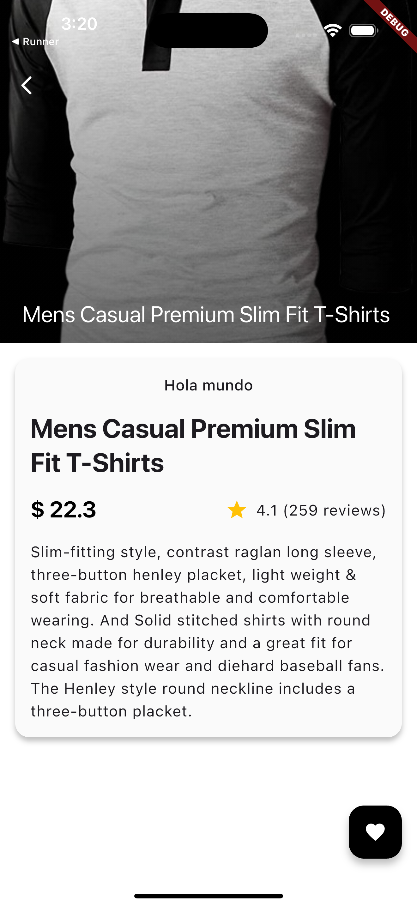
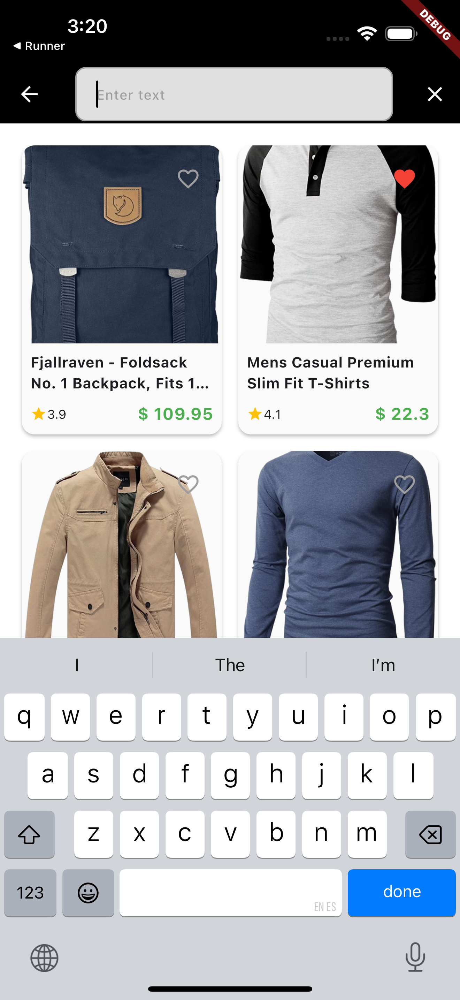
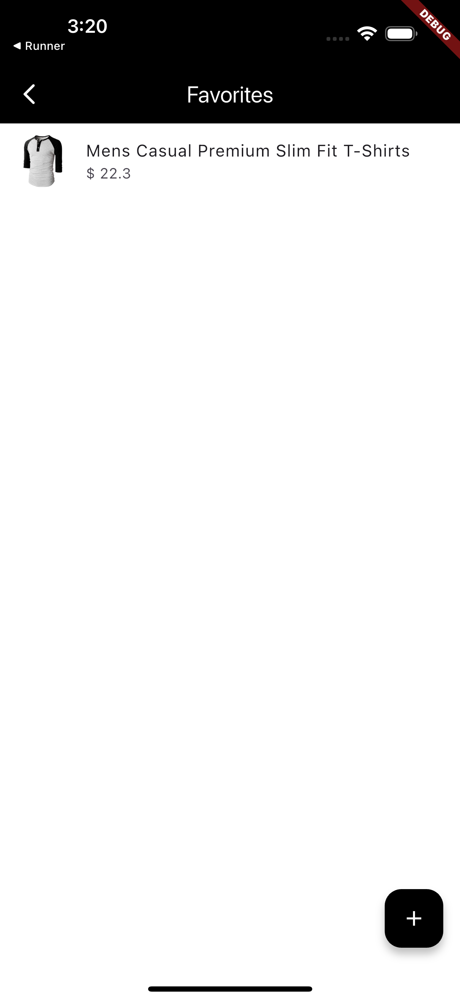

# Aplicación de Tienda

Una moderna aplicación de comercio electrónico construida con Flutter, diseñada para proporcionar una experiencia de compra fluida. Este proyecto es una prueba técnica para Digital Arena y utiliza la API de [Fake Store API](https://fakestoreapi.com) para obtener los datos de los productos.

## Características

*   **Listado de Productos:** Explora una amplia gama de productos con información detallada.
*   **Detalle del Producto:** Visualiza detalles completos de cada producto, incluyendo imágenes, descripciones, precios y valoraciones.
*   **Favoritos:** Marca productos como favoritos para un acceso rápido.
*   **Carrito de Compras:** Añade productos a tu carrito y gestiona tus selecciones.
*   **Diseño Adaptable:** Optimizado para varios tamaños de pantalla y dispositivos.

## Librerías Utilizadas

Este proyecto utiliza las siguientes librerías y paquetes para su funcionamiento y desarrollo:

### Dependencias Principales

*   **`equatable`**: Simplifica las comprobaciones de igualdad de valores en Dart, comúnmente usado con BLoC/Cubit para la gestión de estados.
*   **`flutter_bloc`**: Una popular librería de gestión de estados para Flutter, basada en el patrón BLoC (Business Logic Component).
*   **`go_router`**: Un paquete de enrutamiento declarativo para Flutter, que simplifica la navegación.
*   **`dio`**: Un potente cliente HTTP para Dart, utilizado para realizar solicitudes de red a APIs.
*   **`json_annotation`**: Se utiliza con `json_serializable` para la serialización/deserialización automática de JSON.
*   **`freezed_annotation`**: Se utiliza con `freezed` para generar clases de datos inmutables, uniones y clases selladas.
*   **`drift`**: Una librería de persistencia reactiva para Flutter y Dart, construida sobre SQLite.
*   **`sqlite3_flutter_libs`**: Proporciona la librería nativa de SQLite para Flutter.
*   **`path_provider`**: Un plugin de Flutter para encontrar ubicaciones comunes en el sistema de archivos.
*   **`path`**: Un paquete de Dart para manipular rutas de archivos.

### Dependencias de Desarrollo

*   **`flutter_test`**: El framework de pruebas de Flutter.
*   **`flutter_lints`**: Un conjunto de lints recomendados para fomentar buenas prácticas de codificación.
*   **`build_runner`**: Una herramienta de generación de código utilizada para ejecutar generadores de código (como `freezed`, `json_serializable`, `drift_dev`).
*   **`freezed`**: Generador de código para `freezed_annotation`.
*   **`json_serializable`**: Generador de código para `json_annotation`.
*   **`drift_dev`**: Generador de código para `drift`.

## Decisiones Técnicas

Durante el desarrollo de esta aplicación, se tomaron las siguientes decisiones técnicas clave para asegurar una arquitectura robusta, mantenible y escalable:

### Estructura del Proyecto

Se optó por una arquitectura limpia (Clean Architecture) con una clara separación de responsabilidades en capas (presentación, dominio, datos). Esto facilita la escalabilidad, la realización de pruebas unitarias y la independencia de frameworks, permitiendo que la lógica de negocio sea reutilizable y agnóstica a la UI o la base de datos.

Tambien se uso como referencia varias pruebas técnicas que se me han propuesto:

1. https://github.com/bakamedi/field_visit_app
2. https://github.com/bakamedi/app_task
3. https://github.com/bakamedi/hacom_app_coding_challenge
4. https://github.com/bakamedi/client_management
5. https://github.com/bakamedi/digital_contract
6. https://github.com/bakamedi/tennis_app

### Gestión de Estado

Para la gestión de estado, se eligió **`flutter_bloc`**. Este patrón permite una gestión de estado predecible y testeable, separando la lógica de negocio de la interfaz de usuario. La combinación con **`equatable`** ayuda a optimizar las reconstrucciones de widgets al comparar estados de manera eficiente.

### Enrutamiento

**`go_router`** fue seleccionado como la solución de enrutamiento. Su enfoque declarativo y su capacidad para manejar rutas complejas, navegación profunda y redirecciones, lo hacen ideal para aplicaciones con una estructura de navegación rica y para mejorar la experiencia del usuario.

### Persistencia de Datos

Para el almacenamiento local de datos, se utiliza **`drift`** ofrece una solución robusta y reactiva para datos estructurados, ideal para manejar favoritos o configuraciones de usuario de manera eficiente y segura.

### Comunicación con la API

**`dio`** se empleó para todas las comunicaciones HTTP con la API de Fake Store. `dio` es un cliente HTTP potente con soporte para interceptores, lo que facilita la adición de funcionalidades como logging, autenticación o manejo de errores de forma centralizada.

### Generación de Código

Se hizo un uso extensivo de la generación de código con **`build_runner`**, **`freezed`** y **`json_serializable`**.
*   **`freezed`**: Permite crear clases de datos inmutables, uniones selladas y copiar con facilidad, reduciendo el boilerplate y mejorando la seguridad de tipo.
*   **`json_serializable`**: Automatiza la serialización y deserialización de objetos Dart a/desde JSON, lo que es crucial para interactuar con APIs de manera eficiente y sin errores manuales.
*   **`drift_dev`**: Genera el código necesario para interactuar con la base de datos `drift`, simplificando las operaciones de base de datos.

### Principios de Diseño

La aplicación sigue los principios de **Material Design** para una interfaz de usuario moderna e intuitiva. Se priorizó un **diseño adaptable** para asegurar una experiencia consistente y agradable en diferentes dispositivos y tamaños de pantalla.

## Capturas de Pantalla

| Listado de Productos | Detalle del Producto |
| :---: | :---: |
|  |  |


| Search de Productos | Favoritos |
| :---: | :---: |
|  |  |

## Cómo Empezar

Sigue estas instrucciones para obtener una copia del proyecto y ejecutarla en tu máquina local con fines de desarrollo y prueba.

### Prerrequisitos

Antes de empezar, asegúrate de tener instalado lo siguiente:

*   **Flutter SDK:** [Instalar Flutter](https://flutter.dev/docs/get-started/install)
*   **Git:** [Instalar Git](https://git-scm.com/book/es/v2/Getting-Started-Instalar-Git)

### Instalación

1.  **Clona el repositorio:**

    ```bash
    git clone https://github.com/your-username/store_app.git
    cd store_app
    ```

2.  **Instala las dependencias:**

    ```bash
    flutter pub get

3.  **Generar archivos de código (si es necesario):**

    ```bash
    dart run build_runner build --delete-conflicting-outputs
    ```

4.  **Ejecuta la aplicación:**

    ```bash
    flutter run
    ```

    Este comando iniciará la aplicación en tu dispositivo conectado o emulador.

## Construcción para Producción

Para construir la aplicación para una plataforma específica, utiliza los siguientes comandos:

*   **Android:**

    ```bash
    flutter build apk
    # O para un AppBundle
    flutter build appbundle
    ```

*   **iOS:**

    ```bash
    flutter build ios
    ```

*   **Web:**

    ```bash
    flutter build web
    ```

*   **Windows:**

    ```bash
    flutter build windows
    ```

*   **macOS:**

    ```bash
    flutter build macos
    ```

*   **Linux:**

    ```bash
    flutter build linux
    ```

## Contribución

Las contribuciones son lo que hacen de la comunidad de código abierto un lugar increíble para aprender, inspirar y crear. Cualquier contribución que realices es **enormemente apreciada**.

1.  Haz un Fork del Proyecto
2.  Crea tu Rama de Característica (`git checkout -b feature/NuevaCaracteristica`)
3.  Confirma tus Cambios (`git commit -m 'Añadir alguna NuevaCaracteristica'`)
4.  Sube a la Rama (`git push origin feature/NuevaCaracteristica`)
5.  Abre una Solicitud de Extracción (Pull Request)

## Licencia

Distribuido bajo la Licencia MIT. Copyright (c) 2025 Bakke Medina Abarca. Consulta `LICENSE` para más información.
